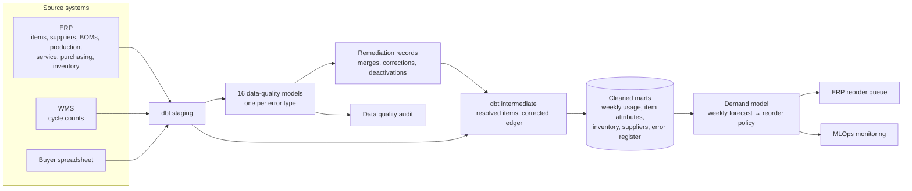

# ERP Data Quality Audit & Demand Forecasting ML Model

This project consists of two parts. 

First, a full data quality audit of the ERP. We found 16 types of error across the system's eight master and transaction tables, remediated them, and put process changes in place so they would not recur. 

Second, a demand forecasting model was trained on the cleaned history. Every week it forecasts demand and makes weekly reordering predictions for each of the shop's 1,300 stocked items. It forecasts the item's expected usage over its supplier lead time and turns this into a reorder point and order quantity. It was calibrated to ensure minimal stockouts, jobs held for material, and expedited freight, while at the same time keeping working capital as low as possible. 

The model is supported by technical documentation and MLOps monitoring in production.

The model's reorder suggestions are embedded in the shop's existing ERP purchasing screen, as shown below:

[](https://brimsystems.github.io/mfg-demand-forecasting/docs/index.html)

> **[Open the live reorder queue &rarr;](https://brimsystems.github.io/mfg-demand-forecasting/docs/index.html)** &nbsp;·&nbsp; **[All five deliverables &rarr;](https://brimsystems.github.io/mfg-demand-forecasting/)**

---

## Business Context

An industrial equipment manufacturer (~$30mm revenue) produces conveyors and material-handling modules, industrial mixers and agitators, and custom enclosures and frames. It stocks about 1,300 items purchased from 40 suppliers. 

Historically, the shop's inventory reordering was done manually and ran on data that was messy and couldn't be trusted. Much of the reordering process was labor-intensive and imprecise: stock levels and lead times were stale, stock on hand was unverified, safety stock was inflated, and rush orders were relied upon to compensate for shortfalls. The result was the shop carrying excess inventory, roughly 160 days of usage, yet still logging elevated stockout events, held jobs for missing material, and rush freight spend.

Over the past six months, the demand forecasting model has been used to set every reorder decision for the shop. The ML model overview and performance report below details the findings across this period. Relying on the model's forecasts, the shop was able to achieve significant improvements across production and purchasing KPIs, while also reducing its inventory balance and freeing up cash tied in working capital.

---

## Deliverables

| # | Deliverable | What it is | Links |
|---|---|---|---|
| 1 | ERP reorder queue | The demand forecasting model embedded in the ERP's purchasing screen: each item's on-hand, allocated, on-order and available stock, forecast usage over its lead time, safety stock, reorder point, and suggested order quantity. | [View](https://brimsystems.github.io/mfg-demand-forecasting/docs/index.html) |
| 2 | Data quality audit | Details the data quality audit, including every type of error found across the ERP's eight tables, the error remediation completed, the before-and-after results, and the process changes that will keep the ERP system clean. | [View](https://brimsystems.github.io/mfg-demand-forecasting/docs/reports/data_quality_audit.html) |
| 3 | ML model overview & performance report | A high-level summary of the demand forecasting model: what it does, the data it learns from, how it sets each reorder, and the results it achieves. | [View](https://brimsystems.github.io/mfg-demand-forecasting/docs/reports/model_overview.html) |
| 4 | ML technical report | The model card, training data and time-based split, model selection and performance, SHAP feature importance, how forecasts turn into reorder decisions, known limitations, and deployment. | [View](https://brimsystems.github.io/mfg-demand-forecasting/docs/reports/technical_report.html) |
| 5 | MLOps monitoring report | Monthly monitoring of the live model's outcomes against retraining thresholds: forecast error and bias overall and by demand pattern, drift, data quality, and business KPIs. | [View](https://brimsystems.github.io/mfg-demand-forecasting/docs/reports/monitoring_report.html) |

---

## Code

### Data pipeline: [`data_pipeline/models/`](data_pipeline/models/)

| Layer | What it is, does and contains |
|---|---|
| Staging | One model per source table (ERP, WMS and the buyers' spreadsheet). Each inputs and cleans the raw data into a consistent shape and format. |
| Data quality | One model for each of the 16 error types identified in the audit. Flags the records affected across the staging tables. |
| Intermediate | Applies the cleanup to the staged data without altering the source. Builds the shared pieces the marts are assembled from, including the item crosswalk and cleaned item master and inventory ledger. |
| Marts | The analysis-ready tables the audit and model read: cleaned demand, weekly usage, item attributes, inventory position, supplier performance, and the audit's error register. |

### Data cleaning: [`data_pipeline/models/data_quality/`](data_pipeline/models/data_quality/) and [`data_source/generate/remediation.py`](data_source/generate/remediation.py)

| File | What it does |
|---|---|
| `data_quality/dq_01` to `dq_16` | Flags the records affected by each of the sixteen errors in the audit. |
| `marts/mart_dq_error_summary.sql` | Rolls the flagged records into the audit's error register: rows affected and rows in scope for each error and ERP table. |
| `remediation.py` | Records every change made during the cleanup: dead-item dispositions, duplicate and supplier crosswalks, UOM conversions, recomputed lead times and reorder points, ledger corrections, document closures and the free-text attributions. |
| `ml/src/reliability.py` | Classes every item's on-hand balance as reliable, uncertain or unreliable, before and after remediation. |
| `ml/src/financials.py` | Measures what the errors cost and what the cleanup achieved, from the records: rush spend and shortages traced to each error, inventory write-offs and phantom on-order, and the before-and-after measures in the audit's results. |

### Demand forecasting ML model: [`ml/src/`](ml/src/)

| File | What it does |
|---|---|
| `export_marts.py` | Exports the dbt marts the model reads to parquet. |
| `baselines.py` | Simple forecasting methods (naive, seasonal naive, moving averages, exponential smoothing, Croston) to serve as baselines. |
| `features.py`, `training.py` | Feature building and evaluation of the three model candidates. |
| `demand_model.py` | The production model: builds the weekly features, tunes and selects best model, retrains it monthly,  converts forecasts into reorder points, safety buffers, and order quantities for the ERP. |
| `explain_weekly.py` | SHAP feature importance, the learning curve, feature correlations and the train, validation and test summary for the technical report. |
| `monitor_weekly.py` | Monthly monitoring against Investigate and Retrain thresholds: forecast error and bias overall and by demand pattern, target, prediction and feature drift, data quality and business KPIs. |

---

## How it works



Raw extracts from the ERP, its warehouse system, and the buyers' spreadsheet, and are then combined by a tested dbt pipeline into conformed marts. Along the way, one data-quality model per error type flags the affected records and feeds the audit's error register, and the remediation is applied through auditable merges. The cleaned marts then feed the demand forecasting model, whose weekly reorder points and order quantities are loaded into the ERP's reorder queue.

---

## Data

The datasets were generated to represent typical records from a manufacturing ERP, its warehouse system and a buyer's spreadsheet, with error types and rates constructed to reflect patterns commonly documented in these systems, so the full workflow can be demonstrated on data that is safe to share publicly. The [generators are in `data_source/generate/`](data_source/generate/).

---

## Running it locally

```bash
# 1. Environment
python3 -m venv .venv
source .venv/bin/activate          # Windows: .venv\Scripts\activate
pip install -e .

# 2. Generate the source data and remediate it
python3 -m data_source.generate.run_generator
python3 -m data_source.generate.validate
python3 -m data_source.generate.remediation
python3 -m data_source.generate.export_truth

# 3. Warehouse: staging, data-quality models, intermediate models and marts
cd data_pipeline && dbt build --profiles-dir . && cd ..
python3 -m ml.src.export_marts

# 4. Baselines, model selection, the weekly forecast and reorder policy, and explainability
python3 -m ml.src.baselines
python3 -m ml.src.training
python3 -m ml.src.training_3way
python3 -m ml.src.demand_model
python3 -m ml.src.explain_weekly

# 5. Replay January to June 2026 on the model's reorder schedule
python3 -m data_source.generate.run_generator
python3 -m data_source.generate.validate
python3 -m data_source.generate.remediation
python3 -m data_source.generate.export_truth
cd data_pipeline && dbt build --profiles-dir . && cd ..
python3 -m ml.src.export_marts
python3 -m ml.src.reliability
python3 -m ml.src.financials

# 6. Monitoring
python3 -m ml.src.monitor_weekly

# 7. Client-facing deliverables
python3 ml/reports/generate_data_quality_audit.py
python3 -m ml.reports.generate_reorder_queue
python3 -m ml.reports.generate_model_overview
python3 -m ml.reports.generate_technical_report
python3 -m ml.reports.generate_monitoring_report
```

The report generators write standalone HTML to [`docs/`](docs/), which GitHub Pages serves.

---

## Stack

| Layer | Tools |
|---|---|
| Integration & transformation | dbt, DuckDB |
| Data quality & remediation | dbt data-quality models, Python, pandas |
| Data generation | Python, pandas, NumPy |
| Modeling | scikit-learn (random forest, ridge regression), XGBoost, Optuna, SHAP |
| Monitoring | SciPy (Jensen-Shannon distance), pandas |
| Reporting | matplotlib, HTML/CSS |
| Delivery | Static HTML, GitHub Pages |
